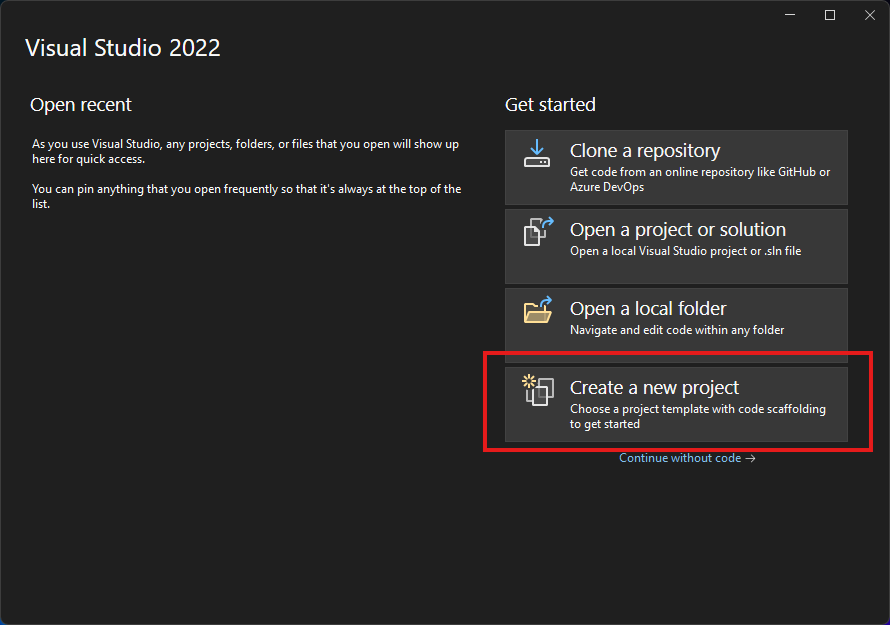
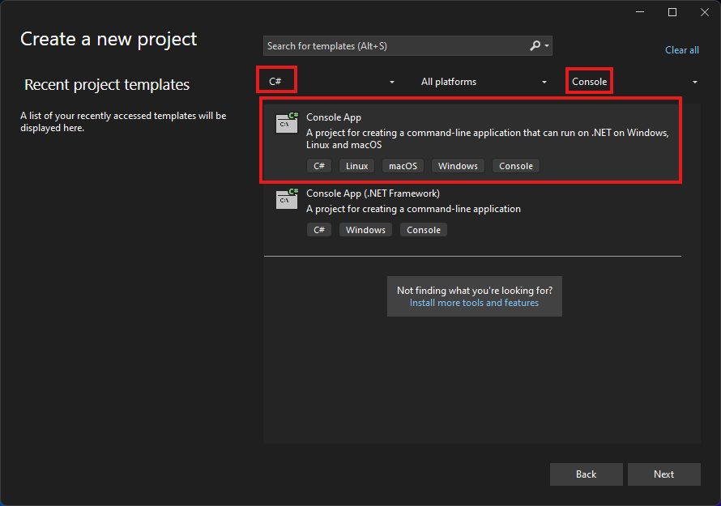
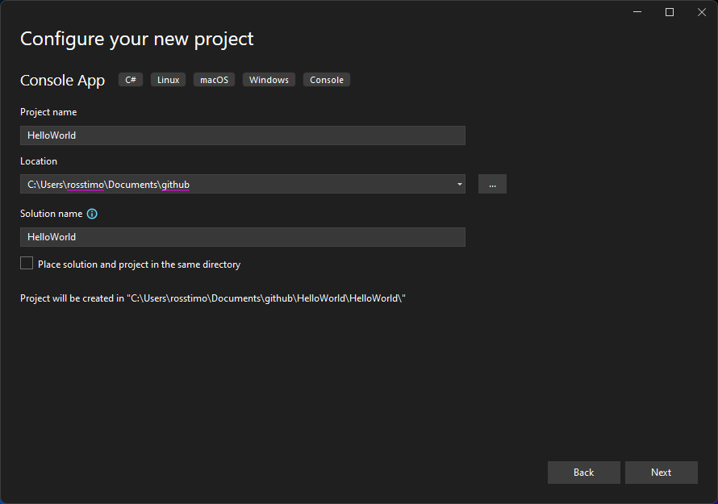
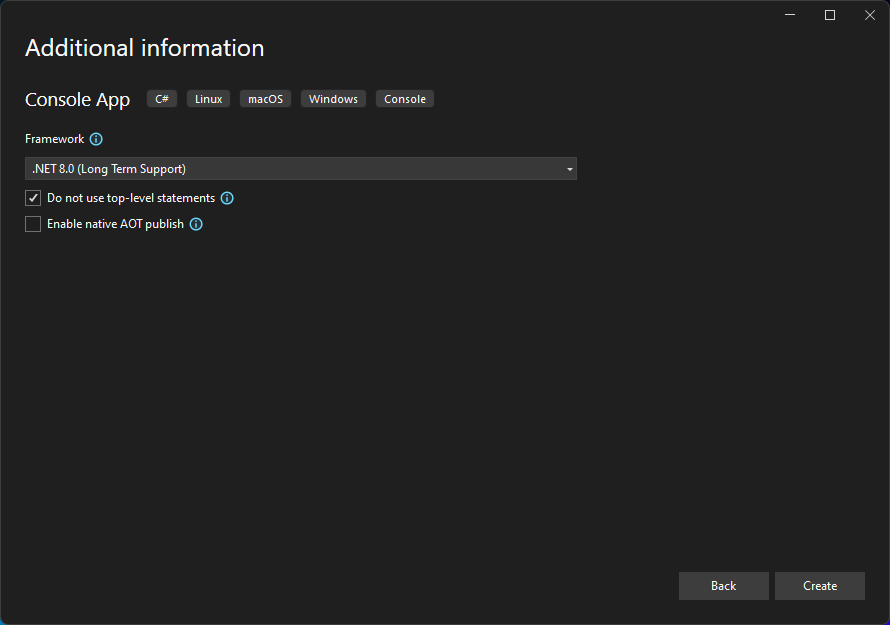
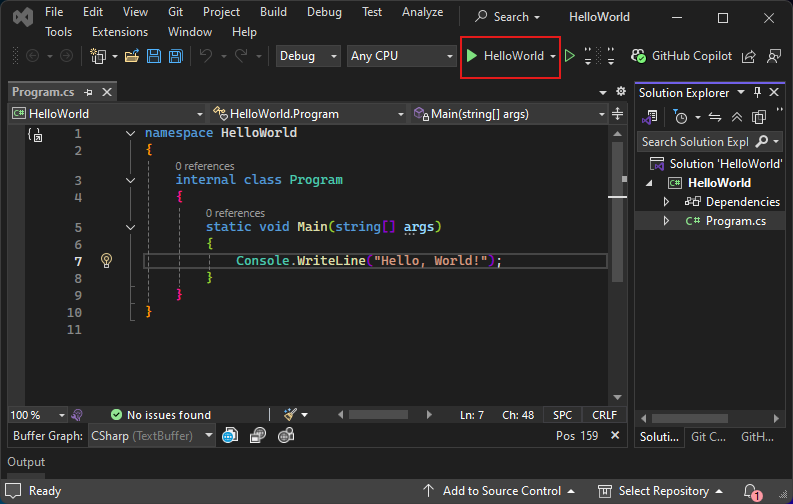
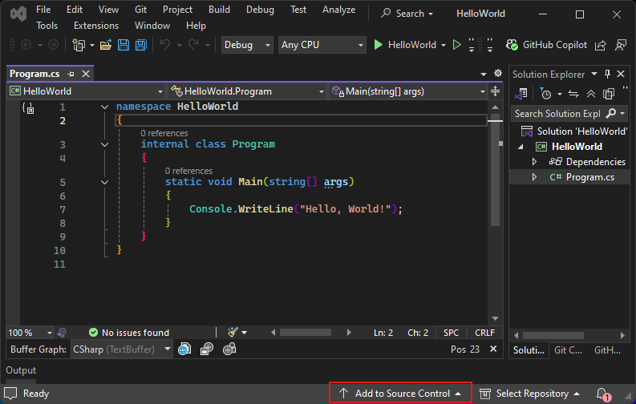
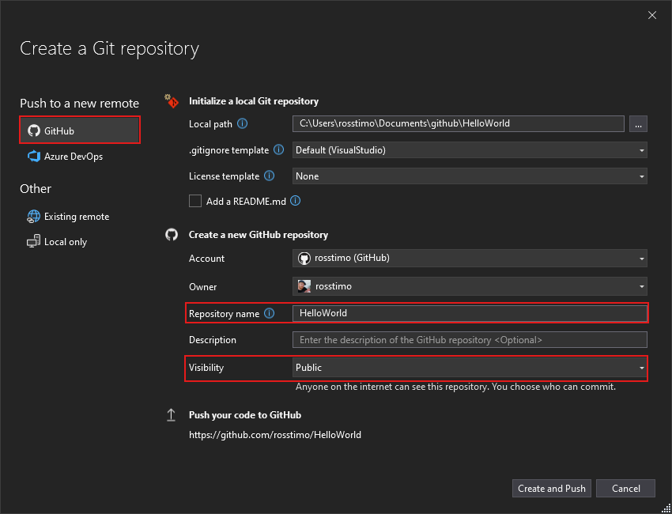

# How to Create and Run a C# Console App in Visual Studio (Absolute Beginner Guide)

This guide walks you step-by-step through creating a C# Console App in Visual Studio using .NET 8 (LTS), and pushing it to GitHub. These instructions are based on a full live walkthrough.

---

## 1. Install Visual Studio

1. Download **Visual Studio Community Edition** from [visualstudio.microsoft.com](https://visualstudio.microsoft.com/).
2. Run the installer.
3. On the **Workloads** screen, check **.NET Desktop Development**.
4. Click **Install** and let it finish.

---

## 2. Create a New .NET 8 C# Console App

1. Launch Visual Studio.
2. Click **Create a new project**.

3. Use the filters:
   - **Language**: C#
   - **Platform**: Windows
   - **Project Type**: Console
4. Select **Console App** (NOT the one that says ".NET Framework").
   - Make sure it just says **Console App** and **C#**. No "Framework" in the name.
5. Click **Next**.

---

## 3. Configure Project Settings

1. **Project name**: Name it something short and clear, like `HelloWorld`.
2. **Location**: Pick a folder where your code will live.
3. **Solution name**: Make this match the project name exactly.
4. **IMPORTANT**: Uncheck **Place solution and project in the same directory**.
5. Click **Next**.

---

## 4. Set the Target Framework and Options

1. In the **Framework** dropdown, select **.NET 8.0 (Long Term Support)**.
2. Check **Do not use top-level statements**.
3. Uncheck **Enable native AOT publish**.
4. Click **Create**.

---

## 5. Run the Console App

1. Click the green **Run** button (or press `F5`).
2. A console window should open with "Hello, World!" output.
3. If it flashes and disappears, add this line at the bottom:

---

## 6. Add to GitHub (Source Control)

1. Go to **View > Git Changes** (or **Git > Git Changes**).

2. Click **Create Git Repository** (if prompted).
3. Choose **GitHub** as the host.

4. Sign in if needed.
5. **Repository name**: This should exactly match your project/solution name.
6. Check **Public** visibility if your instructor needs to access it.
7. Click **Create and Push**.

You're live on GitHub. Make edits, type a commit message, and click **Commit All and Push** to save changes.

---

## 7. Beginner Tips

- Save constantly: `Ctrl+S`
- Use **Solution Explorer** to navigate files.
- Use **Go to Definition** or **Peek Definition** to understand code.
- If it all goes sideways, delete the project and start fresh. No shame in it.

---

## 8. Learn More

- [C# Docs - Microsoft](https://learn.microsoft.com/en-us/dotnet/csharp/)
- [Visual Studio Docs](https://learn.microsoft.com/en-us/visualstudio/get-started/)
- [GitHub + Visual Studio Setup](https://docs.github.com/en/get-started/getting-started-with-git/getting-started-with-git-and-visual-studio)

---

Console app: working. Code: pushed. Brain: upgraded. You're good to go.

