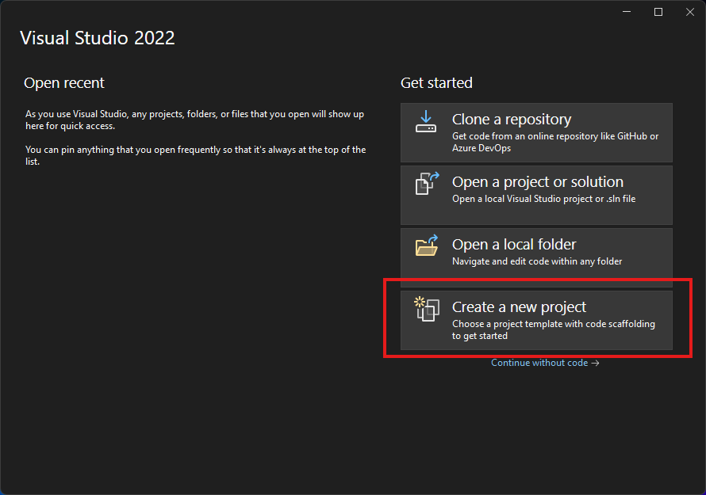
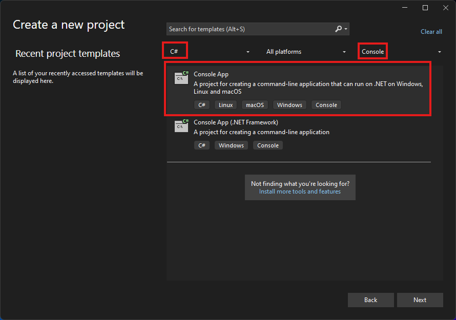
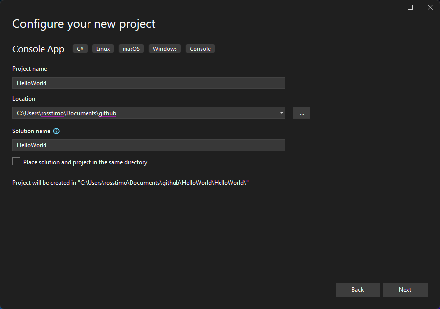
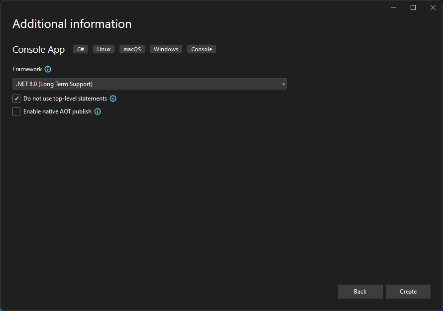
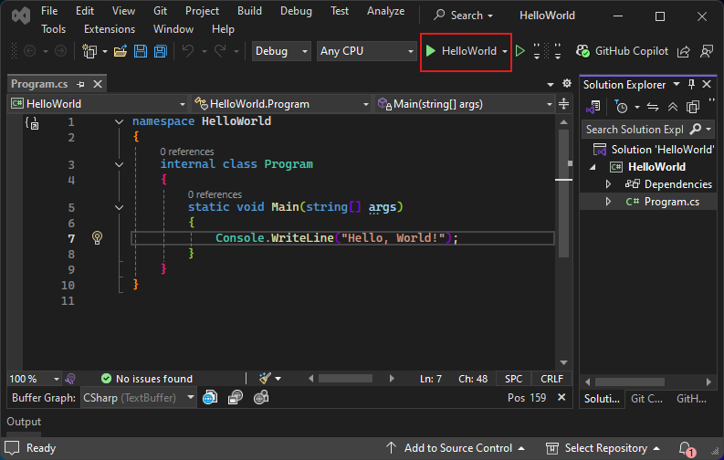
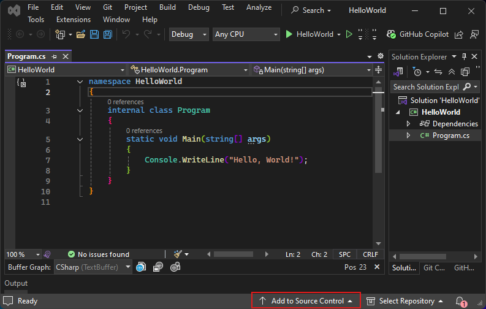
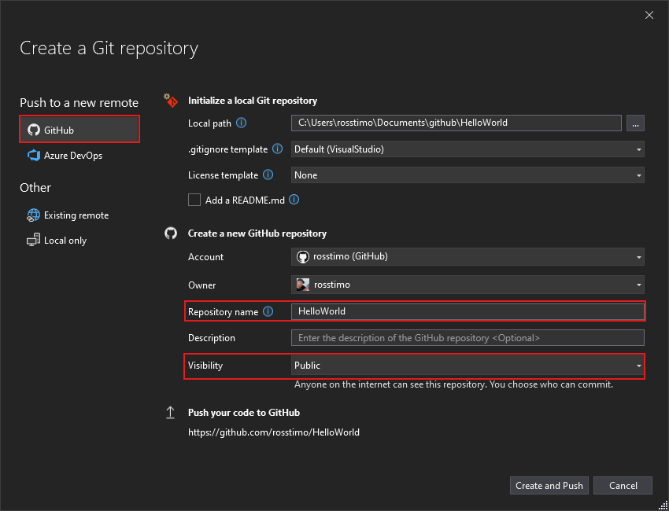

# Create and Run a C# Console App in Visual Studio

This guide shows the RCET 2265 project setup used for C# console assignments in Visual Studio. The course currently targets **.NET 10 (LTS)** and uses an explicit `Program` class and `Main` method rather than top-level statements.

## 1. Install Visual Studio

1. Download **Visual Studio Community** from [visualstudio.microsoft.com](https://visualstudio.microsoft.com/).
2. Run the installer.
3. Select the **.NET desktop development** workload.
4. Complete the installation.

## 2. Create a Console App

1. Launch Visual Studio.
2. Select **Create a new project**.
3. Use these filters if needed:
   - **Language:** C#
   - **Platform:** Windows
   - **Project type:** Console
4. Select **Console App** for modern .NET. Do not select a **.NET Framework** project.
5. Select **Next**.





## 3. Configure the Project

1. **Project name:** use the assignment/project name, such as `HelloWorld`.
2. **Location:** choose the folder where your course repositories belong.
3. **Solution name:** use the same name as the project unless the assignment says otherwise.
4. Uncheck **Place solution and project in the same directory**.
5. Select **Next**.



## 4. Select the Course Options

On the **Additional information** screen:

1. Select **.NET 10.0 (Long Term Support)**.
2. Check **Do not use top-level statements**.
3. Leave **Enable native AOT publish** unchecked.
4. Select **Create**.

The explicit-entry-point option should produce a project shaped like this:

```csharp
namespace HelloWorld
{
    internal class Program
    {
        static void Main(string[] args)
        {
            Console.WriteLine("Hello, World!");
        }
    }
}
```



## 5. Build and Run

1. Build the project and correct any compiler errors.
2. Run the program with the green **Start** button or `F5`.
3. Verify the expected output in the console window.



## 6. Put the Project on GitHub

1. Open **Git > Git Changes**.
2. If the project is not already a Git repository, select **Create Git Repository**.
3. Choose **GitHub** as the remote host and sign in if required.
4. Use the same repository name as the assignment/project unless instructed otherwise.
5. Use the repository visibility required by the course.
6. Select **Create and Push**.





## 7. Normal Work Cycle

Do not treat Git as something you do only when the assignment is finished. A useful cycle is:

```text
edit -> build/test -> review changes -> commit -> push
```

In Visual Studio, the **Git Changes** window lets you review changed files, write a commit message, commit, and push.

## References

- [C# documentation](https://learn.microsoft.com/en-us/dotnet/csharp/)
- [Visual Studio documentation](https://learn.microsoft.com/en-us/visualstudio/)
- [GitHub documentation for Visual Studio](https://docs.github.com/en/get-started/getting-started-with-git/getting-started-with-git-and-visual-studio)
