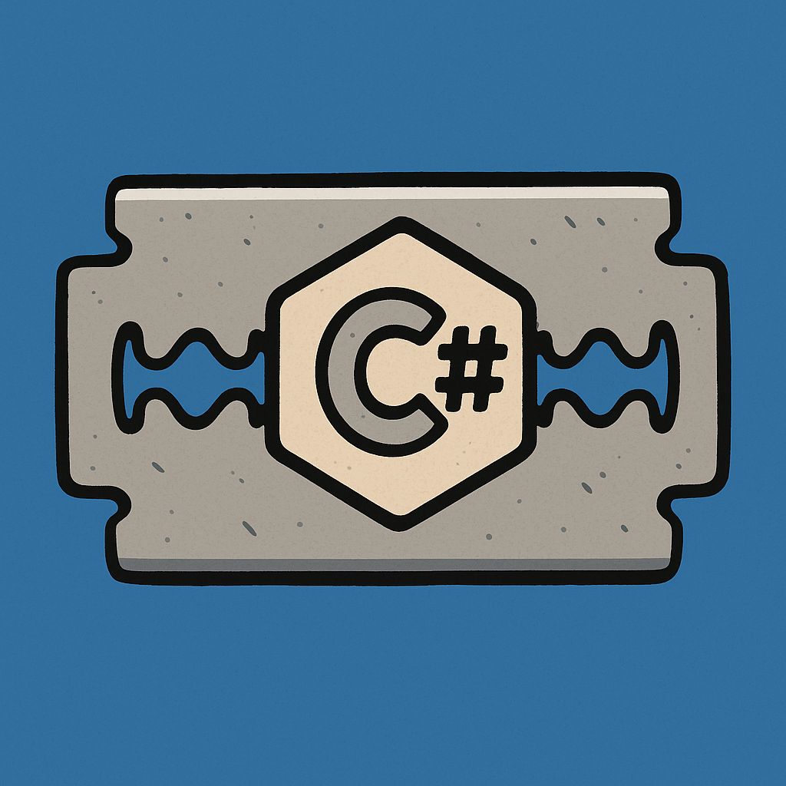

# RCET2265

Student-facing material for **RCET 2265: Computer Fundamentals and Introduction to Programming**.

## Start here

- [Assignment instructions](00-AssignmentInstructions/)
- [Topic reference notes](Topics/)
- [Course examples](Examples/)
- [RCET 2265 C# style guide](StyleGuide/)
- [Additional resources](Resources/)

Use the assignment instructions for required work. The topic notes and examples are supporting references, and the style guide defines the coding conventions used in this course.
